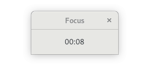
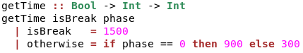

# Pomodoro

Pomodoro timer as simple as it can be. It is showcase of beauty of functional programming in **Haskell**. Where with not
much effort and coding we can get simple, but fully working application. By default it is configured according to 
classical rules:
- 25 minutes of focus (pomodoro)
- 5 minutes break
- 15 minutes break after four pomodoros

but there are instructions how to adjust it to personal needs below. Application on startup shows welcome message then 
immediately turns timer on with first pomodoro. After each phase window pops up informing user about switch.



## Installation

To build program installation of [Haskell Platform](https://www.haskell.org/platform/) is recommended. Then we are able 
to use [Cabal](https://www.haskell.org/cabal/) for installing dependencies:
```
$ cabal install gtk
```

## Adjustment

Before building application open *Pomodoro.hs* file and find function responsible for time management:



Time is given in seconds. Adjust numbers to your needs. By default:
- *1500* seconds (25 minutes) is focus time
- *900* seconds (15 minutes) is long break time
- *300* seconds (5 minutes) is usual break time

***Note:** application depends on clock.png file located in img directory. If you would like to make it single file 
application for better portability consider removing `windowSetIconFromFile window "img/clock.png"` line from 
Pomodoro.hs .*

## Build

```
$ git clone https://github.com/ethru/Pomodoro.git
$ cd Pomodoro
$ ghc Pomodoro.hs
```

## Usage

Just open already built application *Pomodoro* whenever you are ready to start work. Timer will run immediately.

## Project Information

##### Author

Adrian Niec

##### License

This project is under the [MIT](LICENSE) License with exclusion of code interacting with 
[gtk](https://hackage.haskell.org/package/gtk) which is licensed as 
[LGPL-2.1](https://hackage.haskell.org/package/gtk-0.15.5/src/COPYING).
